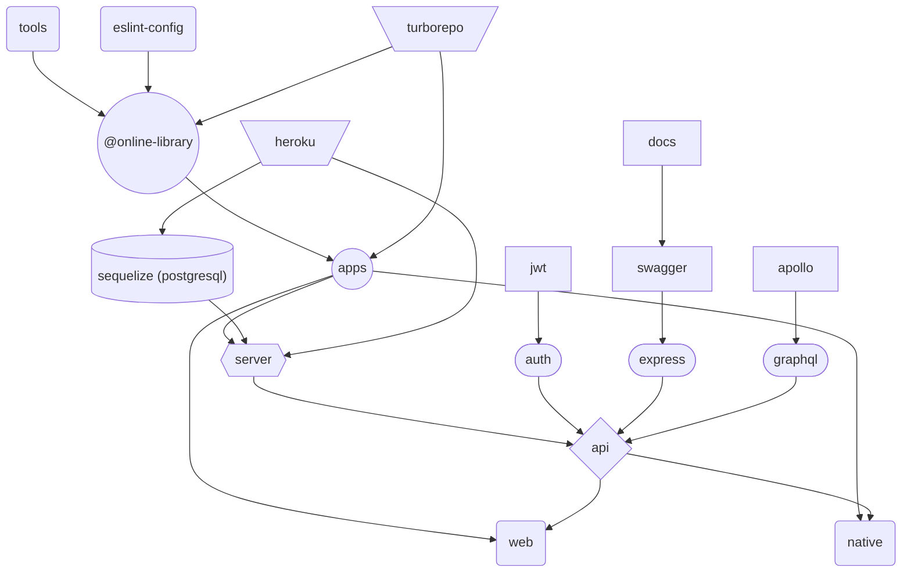

# 💻 Sample js fullstack app (monorepo)

## 🛠️ Technologies & tools

-  **TS** (mapped types, method overloads, type guards)
-  **react.js** ⚛️ + **redux** (hooks, CRA) + **RTL** for testing
-  **react-hook-form** + **yup** for user inputs
-  **styled components** 💅🏾 + **SCSS**
-  **web APIs** (serviceWorker for **web push notifications**, **PWA**)
-  **graphql** (Apollo Express & Apollo Client)
-  **node.js** + **express.js**
-  **passport.js** + **JWT** (kept in cookies) for auth
-  **graphql-ws** + **socket.io** for real time data transport
-  **multer** + **cloudinary** for files upload 📁
-  **sequelize** with **PostgreSQL** database
-  **swagger** + **jsonschema** for **API docs**
-  **paypal** & **stripe** integration for payments 💲
-  monorepo (**yarn** + **turborepo**) for better developer experience (workspaces, tasks pipeline, incremental builds)
-  custom local package [@online-library/tools](https://github.com/kuubson/online-library/tree/master/packages/tools) for sharing stuff between apps
-  eslint, prettier, husky 🧹
-  native app ([online-library-native](https://github.com/toxxiczny/online-library-native))

## 🤖 Stuff automation

-  [@trivago/prettier-plugin-sort-imports](https://www.npmjs.com/package/@trivago/prettier-plugin-sort-imports) for keeping consistent order of imports (custom flow)
-  [graphql-codegen](https://www.the-guild.dev/graphql/codegen) for autogenerated code (hooks & types) from gql schema & documents
-  [@graphql-tools/merge](https://www.graphql-tools.com/docs/schema-merging) for auto merging resolvers & type defs into schema (**custom wrapper** to detect duplicated resolvers)
-  [swagger-autogen](https://github.com/davibaltar/swagger-autogen) for autogenerating **API docs** (allow skipping **YAML** hell 😈)

## 🆒 Side tools

-  [Budibase](https://budibase.com/) (low code platform) for editing database records
-  [Mermaid](https://mermaid-js.github.io/mermaid/#/) for building diagrams with ease
-  [TS errors translator](https://ts-error-translator.vercel.app)
-  [json to ts/jsonschema](https://app.quicktype.io/?l=ts) converter
-  [@faker-js/faker](https://fakerjs.dev/guide/) for seeding db with fake data
-  [picsum.photos](https://picsum.photos) for generating random images

## 🎯 Future goals

-  **test coverage** as high as possible + add e2e tests (**cypress**)
-  consider switching **graphql + sequelize** to **tRPC + prisma**
-  make use of **storybook.js**
-  run app in a **Docker** container
-  integrate **Sentry** for monitoring the app
-  add **WebRTC** for video chat
-  replace errors popup with **react-toastify**

## 📄 A few notes

Sample, **bleeding-edge technologies driven** 💯, fullstack app, [hosted](https://online-library-application.herokuapp.com) on **Heroku** 📡 (deployment & database).

Acts as a **fake store** with possibility to chat with other users.

-  account registration, fb / credentials login
-  **user support** (forgot password, lost activation link)
-  store fulfilled with paid and free books
-  payments with **stripe or paypal**
-  **push notifications** to stay up to date with what other writes
-  possibility to send **images / videos / files**
-  **searchbar** for books
-  **preview** of books inside profile tab
-  **UX**: infinite loaders (store, chat), proper error handling, jump to last unread message (chat), fully responsive

## 🛡️ Documentation

Docs are available in the development environment

-  [REST API](http://localhost:3001/api-docs) - well documented using **OpenAPI** specification

https://user-images.githubusercontent.com/38701627/190416852-2c523abd-96ca-44ef-acbe-78c268ce72e7.mp4

-  [GraphQL API](http://localhost:3001/graphql) - autogenerated with a few additional comments (common **Apollo Studio Explorer**)

## 📺 App preview

### Registration form

### Login form

### Sample error

### Store

### Cart

### Book preview

https://user-images.githubusercontent.com/38701627/190345831-c926f6e7-16c9-4598-a286-df38be3fb25e.mp4

### Chat

## ⚙️ Scripts

| Command            | root                                              | @online-library/tools    | @online-library/client      | @online-library/server     |
| ------------------ | ------------------------------------------------- | ------------------------ | --------------------------- | -------------------------- |
| `yarn dev`         | runs each app & watch-build each package          | watch-build package      | runs react app              | runs nodemon for server.ts |
| `yarn lint`        | lint & ts check each app & package                | lint & ts check          | lint & ts & stylelint check | lint & ts check            |
| `yarn test`        | run tests of all apps & lib only once             | x                        | runs RTL test once          | x                          |
| `yarn test:watch`  | x                                                 | x                        | watch-runs RTL tests        | x                          |
| `yarn build`       | builds each app & package                         | builds package with tsup | builds react app            | build express server       |
| `yarn docs`        | generates docs for API (@online-library/server)   | x                        | x                           | x                          |
| `yarn codegen`     | generates gql code (hooks & types) from schema    | x                        | x                           | x                          |
| `yarn packages`    | force build all packages                          | x                        | x                           | x                          |
| `yarn postinstall` | makes sure to build packages on top of fresh docs | x                        | x                           | x                          |
| `yarn prepare`     | installs husky in development environment         | x                        | x                           | x                          |

## 📊 App flow

