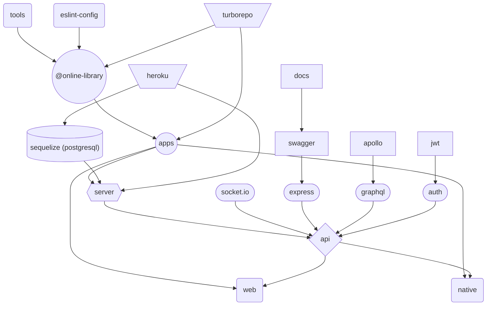

# 💻 Sample js fullstack app (monorepo)

| [Stack](#-stack) | [Notes](#-some-notes) | [Docs](#-documentation) | [Flow](#-flow) | [App preview](#-app-preview) | [Automation](#-automation) | [Tools](#-side-tools) | [Scripts](#-root-scripts) | [Env](#-environment-variables) | [Future goals](#-future-goals) |
| ---------------- | --------------------- | ----------------------- | -------------- | ---------------------------- | -------------------------- | --------------------- | ------------------------- | ------------------------------ | ------------------------------ |

## 🔧 Stack

-  **typescript** (advanced: mapped types, method overloads, type guards)
-  **react.js** ⚛️ + **redux** (CRA, hooks) + **RTL** for testing
-  **react-hook-form** + **yup** for user inputs & validation
-  **styled components** 💅🏾 + **SCSS**
-  **web APIs** (serviceWorker for **web push notifications**, **PWA**)
-  **graphql** (Apollo Express & Apollo Client)
-  **node.js** + **express.js**
-  **passport.js** + **JWT** (kept in cookies) for 🔑 auth
-  **graphql-ws** + **socket.io** for real time data transport
-  **multer** + **cloudinary** for files upload 📁
-  **sequelize** with **PostgreSQL** database
-  **swagger** + **jsonschema** for **API docs**
-  **paypal** & **stripe** integration for 💲 payments
-  monorepo (**yarn** + **turborepo**) for better developer experience (workspaces, tasks pipeline, incremental builds)
-  custom local lib [@online-library/config](https://github.com/kuubson/online-library/tree/master/@online-library/config)[^t]
-  eslint, 🧹 prettier, husky

## 📄 Some notes

> **Note** Sample, **bleeding-edge technologies driven** 💯, fullstack app, [hosted](https://online-library-application.herokuapp.com) on 📡 **Heroku** .

Acts as a **fake store** with possibility to chat 💬 with other users:

-  account registration, fb / credentials login
-  **user support** (forgot password, lost activation link)
-  store fulfilled with paid and free books
-  payments with **stripe** or **paypal**
-  **push notifications** to stay up to date with what other writes
-  possibility to send **images / videos / files**
-  **searchbar** for books
-  **preview** of books inside profile tab
-  **UX**: infinite loaders (store, chat), proper error handling, jump to last unread message (chat), fully responsive

## 🛡 Documentation

> **Note** Docs are available in the development environment

| well documented [REST API](http://localhost:3001/api-docs) using **OpenAPI** specification                          | [GraphQL API](http://localhost:3001/graphql)                                     |
| ------------------------------------------------------------------------------------------------------------------- | -------------------------------------------------------------------------------- |
| <video src="https://user-images.githubusercontent.com/38701627/190416852-2c523abd-96ca-44ef-acbe-78c268ce72e7.mp4"> | autogenerated with a few additional comments (common **Apollo Studio Explorer**) |

## 📊 Flow

## 📺 App preview

| Registration                                                                                                           | Login form                                                                                                           | Sample error                                                                                                    |
| ---------------------------------------------------------------------------------------------------------------------- | -------------------------------------------------------------------------------------------------------------------- | --------------------------------------------------------------------------------------------------------------- |
|  |  |  |

| Store                                                                                                           | Profile                                                                                                           | Book preview                                                                                                        |
| --------------------------------------------------------------------------------------------------------------- | ----------------------------------------------------------------------------------------------------------------- | ------------------------------------------------------------------------------------------------------------------- |
|  |  | <video src="https://user-images.githubusercontent.com/38701627/190917584-ea1c74da-2b37-4730-bf74-ff9d6e245570.mp4"> |

| Chat                                                                                                           | Cart                                                                                                           | Cart Stripe                                                                                                           |
| -------------------------------------------------------------------------------------------------------------- | -------------------------------------------------------------------------------------------------------------- | --------------------------------------------------------------------------------------------------------------------- |
|  |  |  |

## 🤖 Automation

-  [@trivago/prettier-plugin-sort-imports](https://www.npmjs.com/package/@trivago/prettier-plugin-sort-imports) for keeping consistent order of imports (custom flow)
-  [graphql-codegen](https://www.the-guild.dev/graphql/codegen) for autogenerating code (hooks & types) from gql schema & documents
-  [@graphql-tools/merge](https://www.graphql-tools.com/docs/schema-merging) for auto merging resolvers & type defs into schema (**custom wrapper** to detect duplicated resolvers)
-  [swagger-autogen](https://github.com/davibaltar/swagger-autogen) for autogenerating **API docs** (allow skipping **YAML** hell 😈)

## 🆒 Side tools

-  [Budibase](https://budibase.com/) (low code platform) for creating simple panels that help navigating through the database (perfect choice for admin panels)
-  [Mermaid](https://mermaid-js.github.io/mermaid/#/) for diagrams
-  [TS errors translator](https://ts-error-translator.vercel.app)
-  [json to ts/jsonschema](https://app.quicktype.io/?l=ts) converter
-  [@faker-js/faker](https://fakerjs.dev/guide/) for seeding db with fake data
-  [picsum.photos](https://picsum.photos) for generating random images

## 🎯 Future goals

-  **test coverage** as high as possible + add e2e tests (**cypress**)
-  consider switching **graphql + sequelize** to **tRPC + prisma**
-  make use of **storybook.js**
-  run app in a **Docker** container
-  integrate **Sentry** for monitoring the app
-  go **offline-first** with native app (at least chat)
-  finish setup for **i18n**
-  add **WebRTC** for video chat
-  replace errors popup with **react-toastify**
-  tweak seeding db flow

## ⌨ Root scripts

> **Note** To run locally, fill `.env` (see [Environment variables](#-environment-variables) and `.env-example`), trigger `yarn install` and `yarn dev`

| command            | root[^r]                                                                                                                                    |
| ------------------ | ------------------------------------------------------------------------------------------------------------------------------------------- |
| `yarn dev`         | triggers `dev` pipeline ~> launches **web**[^w] & **server**[^s], bundles **tools**[^t] in watchmode                                        |
| `yarn lint`        | triggers `lint` pipeline ~> ts & eslint & stylelint check, through modules[^w][^s][^t]                                                      |
| `yarn test`        | triggers `test` pipeline ~> runs **RTL** tests                                                                                              |
| `yarn build`       | triggers `build` pipeline ~> builds **web**[^w] & **server**[^s], bundles **tools**[^t]                                                     |
| `yarn docs`        | triggers `docs` script of **server**[^s] ~> generates API docs (OpenAPI) from described REST controllers                                    |
| `yarn codegen`     | triggers `graphql codegen` ~> generates hooks & types from graphql schema. Before triggering, have the server running and set env[^codegen] |
| `yarn lib`         | triggers filterred `build` pipeline ~> builds only tools[^t]                                                                                |
| `yarn postinstall` | triggers `yarn lib` & `yarn docs` & `yarn lib` in **this specific** order ~> see note[^order]                                               |
| `yarn prepare`     | triggers `husky install` ~> prepares **husky** on local `yarn install`                                                                      |

## ⚙ Other scripts

| command           | tools[^t]                            | web[^w]                     | server[^s]                                                                                                         |
| ----------------- | ------------------------------------ | --------------------------- | ------------------------------------------------------------------------------------------------------------------ |
| `yarn dev`        | triggers `build` script in watchmode | runs react app              | runs express server with `NODE_ENV` set to `development`                                                           |
| `yarn lint`       | lint & ts check                      | lint & ts & stylelint check | lint & ts check                                                                                                    |
| `yarn test`       | ❌                                   | runs RTL tests only once    | ❌                                                                                                                 |
| `yarn test:watch` | ❌                                   | runs RTL tests in watchmode | ❌                                                                                                                 |
| `yarn build`      | bundles **tools**[^t]                | builds react app            | builds express server & copies ([copyfiles](https://www.npmjs.com/package/copyfiles)) gql related files to `/dist` |
| `yarn docs`       | ❌                                   | ❌                          | generates API docs (OpenAPI) from described REST controllers                                                       |

## 🔒 Environment variables

> **Note** Remember to update `HOST` variable in `@online-library\config\src\utils\urls.ts` when changing domain

| variables                                                               | details                                                                                                       | server[^s]          | web[^w]                            |
| ----------------------------------------------------------------------- | ------------------------------------------------------------------------------------------------------------- | ------------------- | ---------------------------------- |
| `CLOUDINARY_API_KEY` `CLOUDINARY_API_SECRET` `CLOUDINARY_NAME`          | [cloudinary](https://cloudinary.com) API credentials                                                          | all                 | ❌                                 |
| `DATABASE_HOST` `DATABASE_NAME` `DATABASE_PASSWORD` `DATABASE_USERNAME` | PostgreSQL credentials                                                                                        | all                 | ❌                                 |
| `JWT_KEY`                                                               | secret key for `jsonwebtoken`                                                                                 | ✔️                  | ❌                                 |
| `NODEMAILER_USERNAME` `NODEMAILER_PASSWORD`                             | SMTP provider (`nodemailer`) credentials                                                                      | all                 | ❌                                 |
| `PAYPAL_CLIENT_ID` `PAYPAL_CLIENT_SECRET`                               | [paypal](https://developer.paypal.com) API credentials                                                        | all                 | ❌                                 |
| `PRIVATE_VAPID_KEY` `REACT_APP_PUBLIC_VAPID_KEY`                        | `web-push` [package](<(https://www.npmjs.com/package/web-push)>) credentials (`web-push generate-vapid-keys`) | all                 | `REACT_APP_PUBLIC_VAPID_KEY`       |
| `FACEBOOK_APP_SECRET` `REACT_APP_FACEBOOK_APP_ID`                       | fb [app](https://developers.facebook.com/apps) credentials                                                    | all                 | `REACT_APP_FACEBOOK_APP_ID`        |
| `STRIPE_SECRET_KEY` `REACT_APP_STRIPE_PUBLISHABLE_KEY`                  | [stripe](https://dashboard.stripe.com) API credentials                                                        | `STRIPE_SECRET_KEY` | `REACT_APP_STRIPE_PUBLISHABLE_KEY` |
| `CODEGEN`                                                               | see note[^codegen]                                                                                            | ✔️                  | ❌                                 |
| `SEQUELIZE_AUTO`                                                        | set to `true` to re-autogenerate db models from existing tables (generates all methods for associations)      | ✔️                  | ❌                                 |
| `SEED_BOOKS`                                                            | set to `true` to seed db with random books                                                                    | ✔️                  | ❌                                 |
| `SEED_USER`                                                             | set to `true` to seed db with testing user                                                                    | ✔️                  | ❌                                 |

> **Warning** if **Heroku** struggles with the build, set `YARN_PRODUCTION` to `false`

[^r]: root level of the project
[^t]: @online-library/config - lib for sharing stuff between apps. It exposes `API.ts` which transforms autogenerated API docs into usable `API` variable
[^w]: @online-library/web
[^s]: @online-library/server
[^codegen]: must be set to `true` if using **graphql-codegen** (`yarn codegen`) - it skips jwt auth
[^order]: before generating API docs, the lib must be built (otherwise it throws errors) **AND** before lib is built, the API docs must be fresh (because lib depends on API docs)
