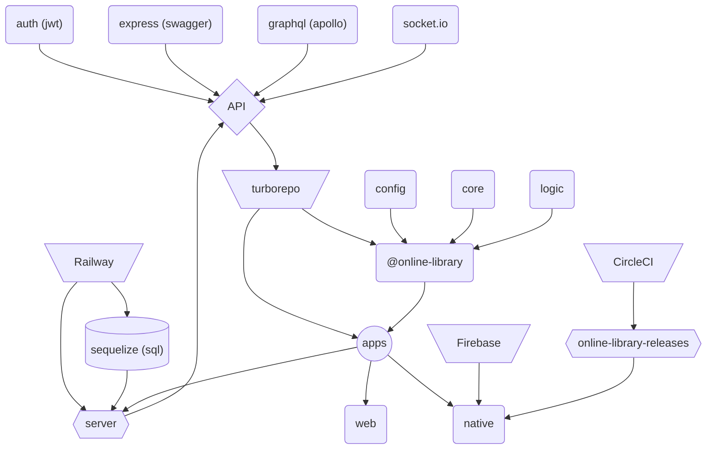

# 💻 js fullstack [app](https://online-library.up.railway.app), monorepo (web & [mobile](https://github.com/kuubson/online-library/tree/master/apps/native#-native-app))

| [Stack](#-stack-) | [Preview](#-app-preview) | [Notes](#-some-notes) | [Flow](#-flow) | [Packages](#-custom-local-packages) | [Docs](#-documentation) | [Tools](#-tools) | [Goals](#-future-goals) | [Scripts](#-root-scripts) | [Env](#-environment-variables) | [Tips](#-tips) |
| ----------------- | ------------------------ | --------------------- | -------------- | ----------------------------------- | ----------------------- | ---------------- | ----------------------- | ------------------------- | ------------------------------ | -------------- |

## 🔧 Stack &nbsp;

     

      

      

> **Note** See the [stack](https://github.com/kuubson/online-library/tree/master/apps/native#-stack-) for the mobile app

## 📺 App preview

| Home                                                                                                           | Login form                                                                                                           | Sample error                                                                                                    |
| -------------------------------------------------------------------------------------------------------------- | -------------------------------------------------------------------------------------------------------------------- | --------------------------------------------------------------------------------------------------------------- |
|  |  |  |

| Store                                                                                                           | Profile                                                                                                           | Book preview                                                                                                        |
| --------------------------------------------------------------------------------------------------------------- | ----------------------------------------------------------------------------------------------------------------- | ------------------------------------------------------------------------------------------------------------------- |
|  |  | <video src="https://user-images.githubusercontent.com/38701627/190917584-ea1c74da-2b37-4730-bf74-ff9d6e245570.mp4"> |

| Chat                                                                                                           | Cart                                                                                                           | Stripe                                                                                                         |
| -------------------------------------------------------------------------------------------------------------- | -------------------------------------------------------------------------------------------------------------- | -------------------------------------------------------------------------------------------------------------- |
|  |  |  |

> **Note** Preview the [mobile app](https://github.com/kuubson/online-library/tree/master/apps/native#-app-preview)

## 📄 Some notes

> **Note** A cutting-edge technologies driven 💯, fullstack, cross-plaftorm app, hosted on 📡 **Railway**

Acts as a **fake store** with possibility to chat 💬 with other users:

-  account registration, fb / credentials login
-  user support (forgot password, lost activation link)
-  store fulfilled with paid and free books
-  payments with **stripe** or **paypal**
-  push notifications to stay up to date with what other writes
-  possibility to send images / videos / files
-  searchbar for books
-  preview of books inside the profile tab
-  targets both web and mobile app users
-  UX: infinite loaders (store, chat), proper error handling, push notifications, fully responsive, jump to the last unread message (chat)

## 📊 Flow

> **Note** See [distribution](https://github.com/kuubson/online-library/tree/master/apps/native#-distribution) flow for the mobile app

## 📦 Custom local packages

| @online-library/config                                                                                                                                                                                | @online-library/core                                                                                                                                         | @online-library/logic                                  |
| ----------------------------------------------------------------------------------------------------------------------------------------------------------------------------------------------------- | ------------------------------------------------------------------------------------------------------------------------------------------------------------ | ------------------------------------------------------ |
| <ul> <li> `yup` config </li> <li> constants, urls, global types</li> <li> custom wrapper (`api.ts`) of an autogenerated `swagger.json` that exposes useful, strongly typed `API` variable </li> </ul> | <ul> <li> `redux` config </li> <li> `graphql` config </li> <li>simulated `i18` config </li> <li> shareable: styles, hooks, helpers, utils, types </li> </ul> | <ul><li> hooks for both web and mobile apps </li></ul> |

## 🛡 Documentation

> **Note** Docs are available in the development environment

| [REST API](http://localhost:3001/api-docs) (**OpenAPI**)                                                            | [GraphQL API](http://localhost:3001/graphql)                                     |
| ------------------------------------------------------------------------------------------------------------------- | -------------------------------------------------------------------------------- |
| <video src="https://user-images.githubusercontent.com/38701627/190416852-2c523abd-96ca-44ef-acbe-78c268ce72e7.mp4"> | autogenerated with a few additional comments (common **Apollo Studio Explorer**) |

## 🆒 Tools

### 🤖 Automation

-  every push to the master branch triggers the autodeployment on Railway + **CircleCI** build workflow (linting, e2e tests, new release of the mobile app that requires an approval)
-  [@trivago/prettier-plugin-sort-imports](https://www.npmjs.com/package/@trivago/prettier-plugin-sort-imports) for keeping a consistent order of imports (custom flow)
-  [graphql-codegen](https://www.the-guild.dev/graphql/codegen) for autogenerating the code (hooks & types) from gql schema & documents
-  [@graphql-tools/merge](https://www.graphql-tools.com/docs/schema-merging) for auto merging resolvers & type defs into schema (**custom wrapper** to detect duplicated resolvers)
-  [swagger-autogen](https://github.com/davibaltar/swagger-autogen) for autogenerating the **API docs** (allow skipping **YAML** hell 😈)

### 🔩 Side tools

-  [Budibase](https://budibase.com/) (low code platform) for creating a simple UI panels (perfect choice for admin panels)
-  [Mermaid](https://mermaid-js.github.io/mermaid/#/) for diagrams
-  [TS errors translator](https://ts-error-translator.vercel.app)
-  [json to ts/jsonschema](https://app.quicktype.io/?l=ts) converter
-  [@faker-js/faker](https://fakerjs.dev/guide/) for seeding db with fake data
-  [picsum.photos](https://picsum.photos) for generating random images

## 🎯 Future goals

-  [x] CRA ~> Vite
-  [ ] **test coverage** as high as possible + add e2e tests (**cypress**)
-  [ ] switch stack **graphql** + **sequelize** ~> **tRPC** + **prisma**
-  [ ] make use of **storybook.js**
-  [ ] run app in a **Docker** container
-  [ ] integrate **Sentry** for monitoring the app
-  [ ] finish setup for **i18n**
-  [ ] add **WebRTC** for video chat
-  [ ] replace errors popup with **react-toastify**
-  [ ] tweak seeding db flow

> **Note** See [goals](https://github.com/kuubson/online-library/tree/master/apps/native#-future-goals) for the mobile app

## ⌨ Root scripts

> **Note** To run locally, install proper version of nodejs (use `nvm` / see `.nvmrc`), fill `.env` (see [Environment variables](#-environment-variables) and `.env-example`), trigger `yarn install` and `yarn dev`

> **Warning** Remember to bump release tag version (`config.yml`) when pushing to the master branch othwerise CircleCI will fail

| command            | description                                                                                                     |
| ------------------ | --------------------------------------------------------------------------------------------------------------- |
| `yarn start`       | triggers `start` script in `/server` ~> runs server production build                                            |
| `yarn start:local` | triggers `start:local` script in `/server` ~> runs server production build for `CircleCI` + `Cypress` purposes  |
| `yarn dev`         | triggers `dev` pipeline ~> launches apps, bundles all packages (watchmode)                                      |
| `yarn lib:dev`     | triggers filtered `dev` pipeline ~> bundles only packages (watchmode)                                           |
| `yarn lint`        | triggers `lint` pipeline ~> ts & eslint & stylelint check through all apps and packages                         |
| `yarn test`        | triggers `test` pipeline ~> runs tests for mobile app                                                           |
| `yarn test:e2e`    | triggers `test:e2e` script in `/web` ~> runs e2e tests for web app                                              |
| `yarn cypress`     | triggers `cypress` script in `/web` ~> runs e2e tests for web app                                               |
| `yarn build`       | triggers `build` pipeline ~> build all apps, bundles all packages                                               |
| `yarn postbuild`   | triggers `yarn lib` script ~> makes sure that all packages are built on top of the newest docs                  |
| `yarn lib`         | triggers `lib:build` pipeline ~> bundles all packages                                                           |
| `yarn android`     | triggers `android` script in `/native` ~> runs the android app                                                  |
| `yarn metro`       | triggers `metro` script in `/native` ~> runs the metro server                                                   |
| `yarn server`      | triggers `dev` script in `/server` ~> runs the express server                                                   |
| `yarn docs`        | triggers filtered `docs` pipeline ~> generates the API docs (**OpenAPI**) from comments of the REST controllers |
| `yarn codegen`     | triggers `graphql codegen` ~> generates hooks & types from graphql schema                                       |
| `yarn postinstall` | triggers `yarn lib` script ~> makes sure that `build` pipeline runs without any errors                          |

## 🔎 Detailed scripts

| command            | server                                                                                                                 | web                         | each package                    |
| ------------------ | ---------------------------------------------------------------------------------------------------------------------- | --------------------------- | ------------------------------- |
| `yarn start`       | runs the server production build (serves also the web app)                                                             | ❌                          | ❌                              |
| `yarn start:local` | runs the server production build on specific port (needed for `CircleCI` + `Cypress`)                                  | ❌                          | ❌                              |
| `yarn dev`         | runs express server with `NODE_ENV` set to `development`                                                               | runs the react app          | bundles the package (watchmode) |
| `yarn lint`        | lint & ts check                                                                                                        | lint & ts & stylelint check | lint & ts check                 |
| `yarn test:e2e`    | ❌                                                                                                                     | runs e2e tests              | ❌                              |
| `yarn build`       | builds the express server & copies ([copyfiles](https://www.npmjs.com/package/copyfiles)) gql related files to `/dist` | builds the react app        | bundles the package             |
| `yarn docs`        | generates API docs (**OpenAPI**) from comments of the REST controllers                                                 | ❌                          | ❌                              |

> **Note** See [scripts](https://github.com/kuubson/online-library/tree/master/apps/native#-scripts) for the mobile app

## 🔒 Environment variables

| details                                                                                                       | server                                                                  | web                           |
| ------------------------------------------------------------------------------------------------------------- | ----------------------------------------------------------------------- | ----------------------------- |
| [cloudinary](https://cloudinary.com) API credentials                                                          | `CLOUDINARY_API_KEY` `CLOUDINARY_API_SECRET` `CLOUDINARY_NAME`          | ❌                            |
| PostgreSQL credentials                                                                                        | `DATABASE_HOST` `DATABASE_NAME` `DATABASE_PASSWORD` `DATABASE_USERNAME` | ❌                            |
| secret key for `jsonwebtoken`                                                                                 | `JWT_KEY`                                                               | ❌                            |
| email address for the email sender (eg. no-reply@online-library.com)                                          | `NODEMAILER_USERNAME`                                                   | ❌                            |
| SMTP provider (`nodemailer` credentials)                                                                      | `MAILJET_USER` `MAILJET_PASSWORD`                                       | ❌                            |
| [paypal](https://developer.paypal.com) API credentials                                                        | `PAYPAL_CLIENT_ID` `PAYPAL_CLIENT_SECRET`                               | ❌                            |
| `web-push` [package](<(https://www.npmjs.com/package/web-push)>) credentials (`web-push generate-vapid-keys`) | `PRIVATE_VAPID_KEY` `VITE_PUBLIC_VAPID_KEY`                             | `VITE_PUBLIC_VAPID_KEY`       |
| fb [app](https://developers.facebook.com/apps) credentials                                                    | `FACEBOOK_APP_SECRET` `VITE_FACEBOOK_APP_ID`                            | `VITE_FACEBOOK_APP_ID`        |
| [stripe](https://dashboard.stripe.com) API credentials                                                        | `STRIPE_SECRET_KEY`                                                     | `VITE_STRIPE_PUBLISHABLE_KEY` |
| set to `true` to re-autogenerate db models from existing tables (generates all methods for associations)      | `SEQUELIZE_AUTO`                                                        | ❌                            |
| set to `true` to seed db with some random books                                                               | `SEED_BOOKS`                                                            | ❌                            |
| set to `true` to seed db with a testing user                                                                  | `SEED_USER`                                                             | ❌                            |

> **Note** See [envs](https://github.com/kuubson/online-library/tree/master/apps/native#-environment-variables) for the mobile app

## 🔐 CircleCI variables (+ all envs for the `server`)

> **Note** To be able to run e2e tests, all server env variables are also required on the CircleCI

| variable                                                                               | details                                                                                                   |
| -------------------------------------------------------------------------------------- | --------------------------------------------------------------------------------------------------------- |
| `GITHUB_TOKEN`                                                                         | personal access token for Github CLI orb                                                                  |
| `RELEASE_KEYSTORE_BASE64`                                                              | release keystore converted to base64 (more [info](https://circleci.com/docs/deploy-android-applications)) |
| `RELEASE_KEYSTORE` `RELEASE_KEY_ALIAS` `RELEASE_KEY_PASSWORD` `RELEASE_STORE_PASSWORD` | keystore related details (more [info](https://circleci.com/docs/deploy-android-applications))             |

## 📙 Tips

-  #### Remember to update the `HOST` variable in `@online-library\config\src\utils\urls.ts` when changing a target domain
